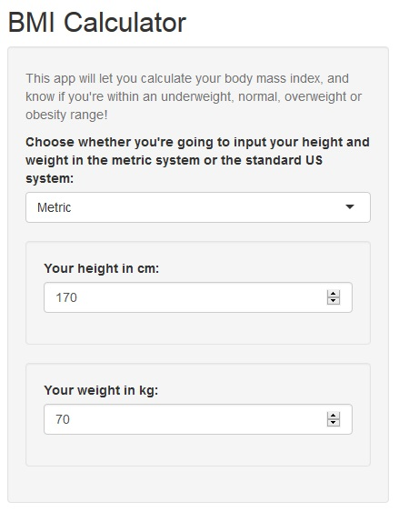

## So what's the Body Mass Index?

- The Body Mass Index (BMI) is a way to quantify the amount of tissue mass in your body, and it let's you know if you can be considered to be anywhere from underweight to obese.  

- Usually you'd want to be around the **normal** range, which goes from 18.5kg/m2 to 25kg/m2, although you could be outside this range and still be considered healthy.
  - There's no such thing as a one-measure-fits-all!

--- 

## OK, now I'm all thrilled about knowing my BMI! How do I calculate it?

- The calculation of the BMI is as <span title="It is kg/m2" style="color:red">complicated</span> as it can get, but _fear not_, because there's [this](https://jesupb.shinyapps.io/BMI_Calculator/) awesome app that'll do the calculation for you!

- You can try it right here!


<iframe src="https://jesupb.shinyapps.io/BMI_Calculator/" style="border-style:dashed;padding:1em"></iframe> 

---

## How do I use the calculator?

<div style="float:left;margin-right: 50px;"></div>

<div>
<h3 style="color:#009933">Using the app is really easy!</h3>
<ul>
    <li>Find out your weight in <var>kg</var> or <var>lbs</var>.</li>
    <li>Find out your height in meters or inches.</li>
    <li>Tell the app if you took your measures in the metric system or the USA standard system.</li>
    <li>Tell the app your measures.</li>
    <li>Get your results immediatly!</li>
</ul>
</div>

---

## What's going on in the calculator?

If you are the nerdy kind of person, and really _really_ want to know what's going on inside the calculator, I'll leave this code chunk here for you to check:

```{r}
my_height <- 1.75 # in meters
my_weight <- 75  # in kg
my_bmi <- my_weight/my_height^2
my_bmi
```

As I said before, as complicated as it gets.

Thanks for checking out my project :)
